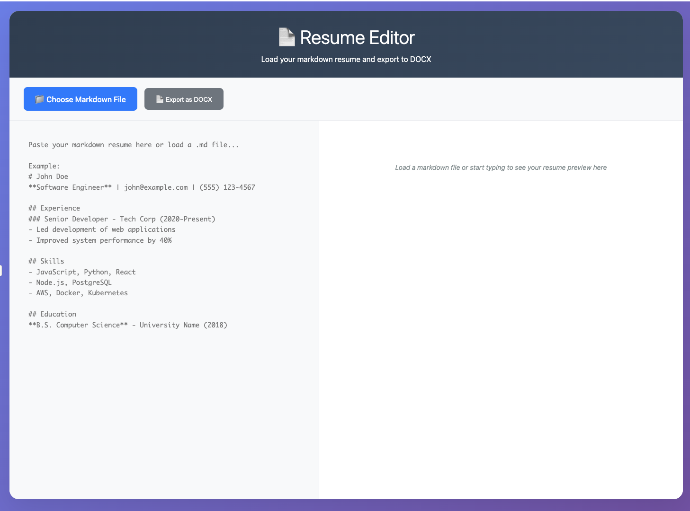

# **Resume Editor**

This is a simple web application designed to help you manage your resume in a browser. It's particularly useful for tailoring your resume to different job descriptions, aiming to simplify the updating process and reduce the effort often associated with optimizing for Applicant Tracking Systems (ATS). Write your resume in Markdown, preview it in your browser, and then export it as a professional PDF or DOCX document.

## **Features**

* **Markdown to HTML Conversion:** Your Markdown resume is converted and displayed as standard HTML right in your browser.  
* **File Upload:** You can easily load your resume from a .md or .txt file.  
* **Live Preview:** As you type or load a file, you'll see your resume update instantly on the right side of the screen.  
* **Export to PDF:** Generate a PDF version of your resume, complete with predefined page margins and in standard letter format.  
* **Export to DOCX:** Create a Microsoft Word (.docx) document of your resume, also with consistent page margins and letter format.  
* **Consistent Margins:** Ensure the page margins look similar whether you're viewing it in your browser, as a PDF, or as a DOCX file.

## **How to Use**

Setting up and using this project is quite simple, as it's just a single HTML file.

1. **Download:** Grab the resume-editor.html file and save it to your computer.  
2. **Open in Browser:** Just double-click the resume-editor.html file, or drag it into your preferred web browser (like Chrome, Firefox, Edge, or Safari).

### **Viewing Your Resume**

* **Type Directly:** You can start typing or paste your Markdown-formatted resume directly into the large text area on the left. The preview will update as you go.  
* **Load a File:** If you have your resume saved as a Markdown file, click the "Choose Markdown File" button to select a .md or .txt file from your computer. The content will appear in the editor, and the preview will update.

### **Exporting Your Resume**

Once your resume looks good in the preview:

* **Export as PDF:** Click the "Export as PDF" button. A PDF file named resume.pdf will be created and downloaded.  
* **Export as DOCX:** Click the "Export as DOCX" button. A DOCX file named resume.docx will be created and downloaded.

## **Margin Consistency**

The application is set up to use standard **Letter (8.5in x 11in)** paper format with the following margins for both PDF and DOCX exports:

* **Top Margin:** 0.5 inches  
* **Bottom Margin:** 0.5 inches  
* **Left Margin:** 0.6 inches  
* **Right Margin:** 0.6 inches

The live web preview is designed to give you a good idea of how these margins will look in the final exported documents.

## **Technologies Used**

This project relies on a few key web technologies and libraries:

* **HTML5:** Provides the basic structure for the web page.  
* **CSS3:** Handles all the styling and ensures the layout adapts to different screen sizes.  
* **JavaScript (ES6+):** Powers all the interactive features.  
* **Marked.js:** This library quickly converts your Markdown text into HTML.  
  * [https://cdnjs.cloudflare.com/ajax/libs/marked/4.3.0/marked.min.js](https://cdnjs.cloudflare.com/ajax/libs/marked/4.3.0/marked.min.js)  
* **html2pdf.js:** Used for generating PDF files directly from the HTML content.  
  * [https://cdnjs.cloudflare.com/ajax/libs/html2pdf.js/0.10.1/html2pdf.bundle.min.js](https://cdnjs.cloudflare.com/ajax/libs/html2pdf.js/0.10.1/html2pdf.bundle.min.js)  
* **FileSaver.js:** Helps in saving the generated PDF and DOCX files to your computer.  
  * [https://cdnjs.cloudflare.com/ajax/libs/FileSaver.js/2.0.5/FileSaver.min.js](https://cdnjs.cloudflare.com/ajax/libs/FileSaver.js/2.0.5/FileSaver.min.js)  
* **html-docx-js:** Converts the HTML content into a DOCX format.  
  * [https://unpkg.com/html-docx-js@0.3.1/dist/html-docx.js](https://unpkg.com/html-docx-js@0.3.1/dist/html-docx.js)

## **Interface**

Here's a quick look at the Resume Editor in action:

## **Contributing**

If you'd like to contribute, feel free to fork this repository, open issues, or submit pull requests. Your contributions are welcome\!

## **License**

This project is open source and available under the [MIT License](https://opensource.org/licenses/MIT).
